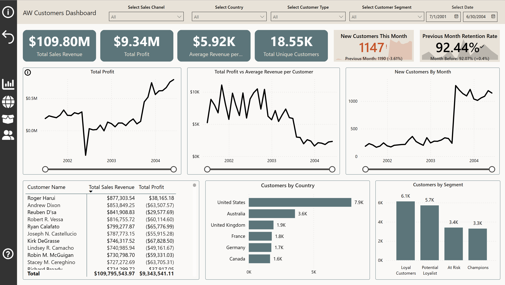

# AdventureWorks Sales Dashboards

📂 Project Structure

- **data/**  
  Raw AdventureWorks sales tables in CSV format.  
- **AW_Dashboard.pbix**  
  The Power BI Desktop file containing all visuals, measures, and data model.  
- **Images/**  
  Image assets used in the dashboard and README.  
- **AW_Dashboard.pdf**   
  A printable guide with screenshots of each report page.  

---

## 📊 Project Overview

As part of my ongoing effort to strengthen my Power BI skills and develop a more analytical mindset, I created my most advanced project to date - a comprehensive **Sales & Customer Insights Dashboard Suite** based on the AdventureWorks dataset.

This project features **four interconnected dashboards**:
- **Executive Overview**
- **Sales Team Performance**
- **Product Insights**
- **Customer Insights**

The goal was to move beyond basic reporting and deliver a fully interactive, insight-driven solution for decision-makers. It highlights **key performance metrics**, **strategic business insights**, **trend analysis**, and **customer segmentation** - all while applying **best practices in dashboard design, data modeling, and storytelling**.
While the AdventureWorks dataset was already relatively clean, it was not immediately ready for advanced analysis. To support meaningful insights, I:  

- **Connected tables through primary and foreign keys** to build a robust **star schema** optimized for reporting and performance.  
- Performed targeted **feature engineering**, such as creating calculated columns and measures, to enable **deeper analysis of customer behavior, product performance, and sales trends**.  
- Ensured the model followed **best practices in data modeling**, making it both scalable and efficient for DAX calculations.  

This preparation laid the foundation for dashboards that go beyond surface-level reporting and provide **actionable insights** for different stakeholder groups.  

---
## 📸 Preview

---

## 🖼 Executive Dashboard – Screenshots

|  |  |  |
|-------------------------------------|------------------------------------------------|----------------------------------------------------|
| **Main Overview** of KPIs, sales, profit, and trends across channels. | **Tooltip Example** showing YoY growth for revenue, profit, orders, and new customers. | **Toggleable Sidebar** with executive-level written insights (channel, product, region, retention). |

---

## 🖼 Additional Dashboards

|  |  |  |
|------------------------------------------------------|----------------------------------------------------|--------------------------------------------|
| **Product Trends** - YoY growth, top-selling products, and selected product analysis. | **Sales Team Overview** with breakdown by country and detailed product-level profit (and tooltip example). | **Customer Metrics** — Retention, monthly growth, segmentation, and top customers. |

---

## 🧰 Tech Stack

This project was built entirely in **Power BI Desktop** and includes:

- **Power BI** – Core tool for data visualization and dashboard development  
- **DAX (Data Analysis Expressions)** – Used to create advanced measures and KPIs (e.g., YoY growth, retention rate, dynamic tooltips)  
- **Power Query (M Language)** – Applied for data transformation, filtering, and shaping  
- **AdventureWorks Dataset** – A simulated e-commerce and retail dataset  
- **Bookmarks, Tooltips, and Drill-throughs** – Implemented to improve interactivity and user navigation  
- **Dynamic Panels & Toggle Buttons** – Enhance the user experience with flexible, context-sensitive storytelling  

---

## 🧗‍♂️ Challenges & What I Learned

This project was both a creative and technical milestone for me. Here are some key challenges I encountered and what I learned along the way:

- **Building advanced interactivity using tooltips, bookmarks, and toggles**  
  Combining bookmarks, conditional logic, and DAX to control element visibility took several iterations - but taught me how to create a more guided and user-friendly experience.

- **Designing meaningful KPIs from raw data**  
  Interpreting the AdventureWorks dataset and transforming it into useful business metrics (like retention rate, YoY growth, and customer segmentation) pushed me to think like an analyst,  not just a report builder.

- **Balancing visual clarity with analytical depth**  
  One of the most challenging aspects was fitting rich analytical content into a clean and intuitive layout, especially for executive-level users with limited time.

- **Communicating insights clearly**  
  Adding a sidebar with written takeaways helped me shift focus from “just showing charts” to “telling the story behind the data.” This improved my business communication and insight delivery.

Overall, this project significantly improved my skills in **Power BI development, data storytelling, stakeholder thinking**, and **analytical design**.

